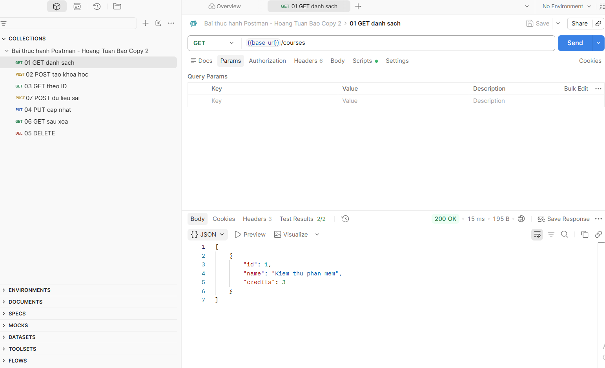
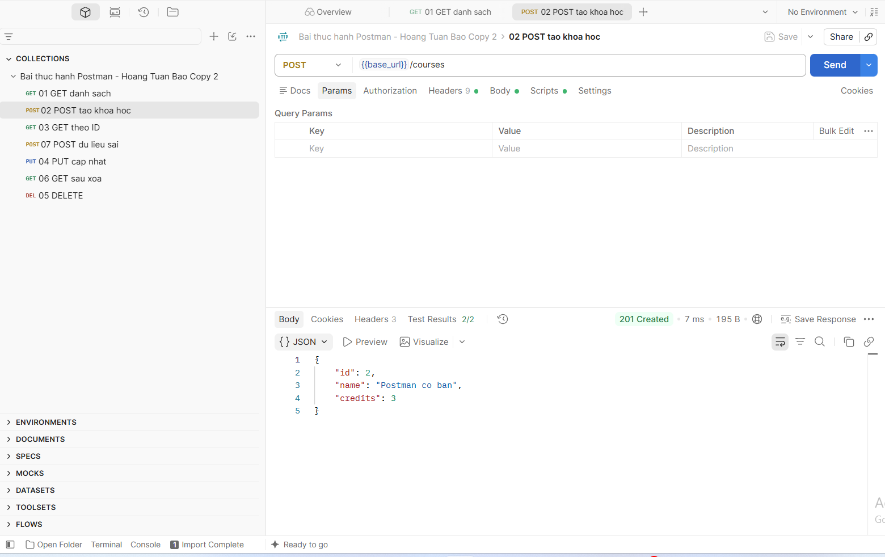
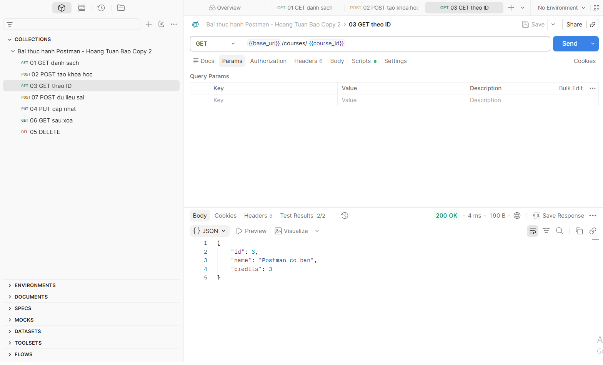
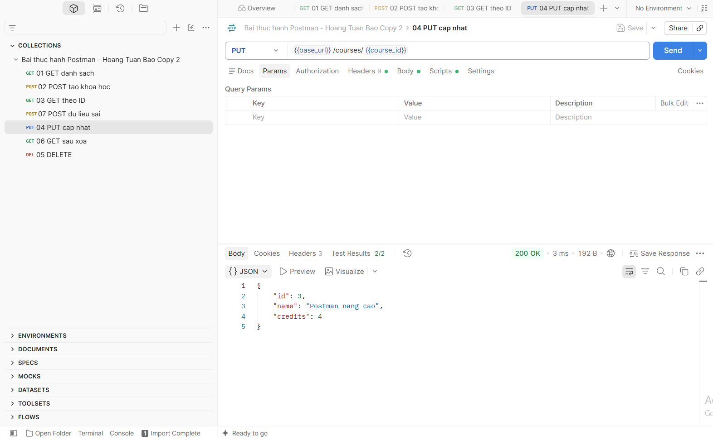
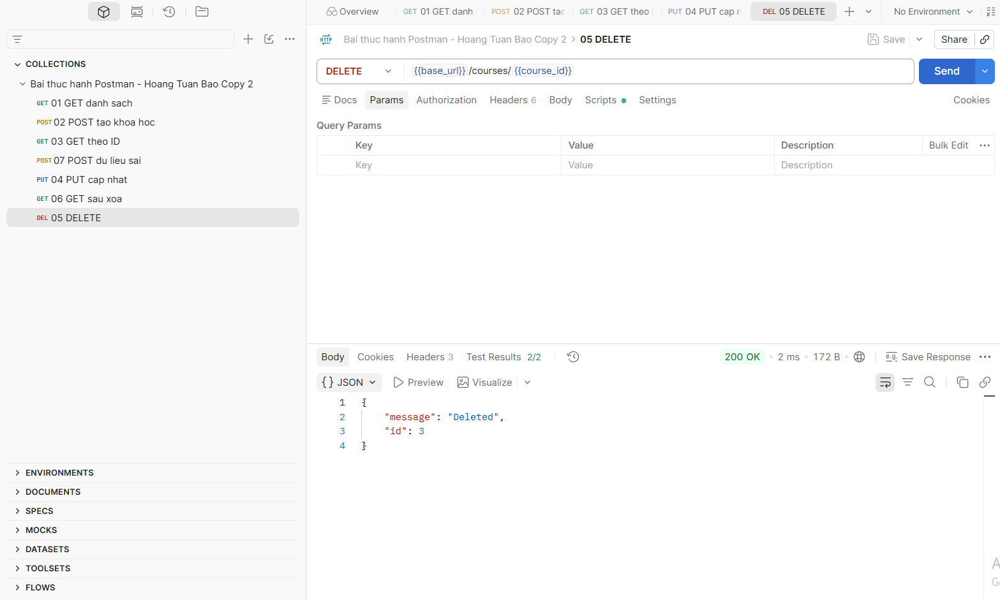
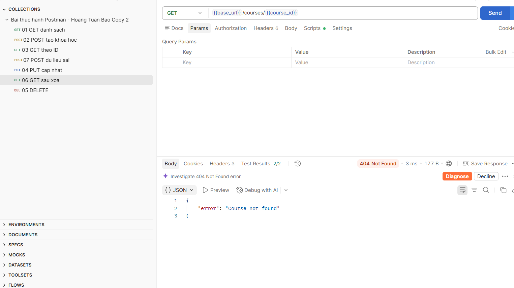
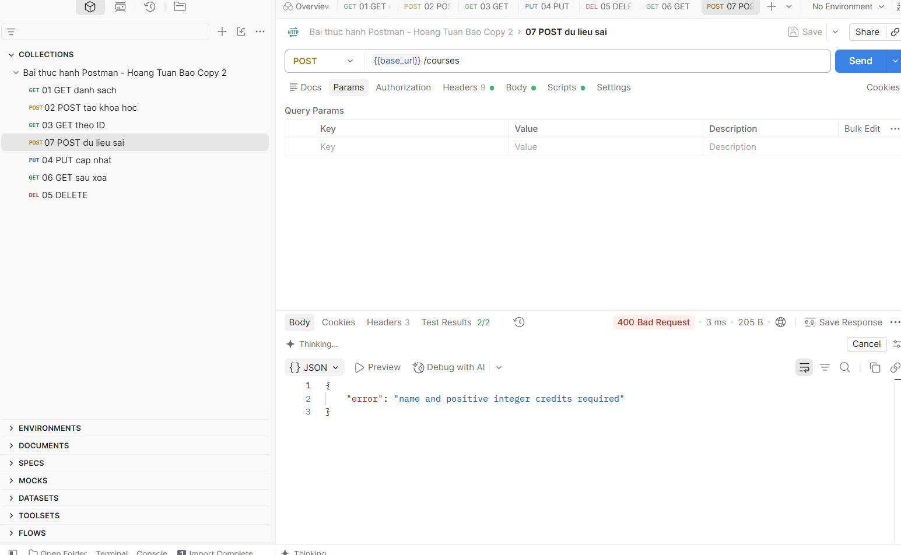

# Báo cáo thực hành kiểm thử API bằng Postman

**Sinh viên:** Hoàng Tuấn Bảo — **MSSV:** 23010194

## 1. Mục tiêu
Tìm hiểu Postman, tổ chức request trong Collection, sử dụng biến URL, gửi GET/POST/PUT/DELETE và viết JavaScript kiểm tra phản hồi.

## 2. Giới thiệu công cụ
Postman giúp tạo yêu cầu HTTP, cấu hình URL, headers, body và quan sát status code, thời gian phản hồi, dữ liệu JSON. Collection gom các request; biến giúp tái sử dụng URL. Script sau phản hồi kiểm tra kết quả tự động.

## 3. Môi trường và dữ liệu
- Postman Desktop, Python 3 và API khóa học đi kèm `server.py`.
- URL: `http://127.0.0.1:8000`; không cần tài khoản hoặc API key.
- Khóa học có các trường `id`, `name`, `credits`.
- Dữ liệu lưu trong RAM, khởi động lại server sẽ đặt lại dữ liệu. Đây là API tự xây dựng phục vụ bài thực hành.

## 4. Các bước thực hiện
1. Mở terminal tại thư mục bài, chạy `py server.py` trên Windows (hoặc `python3 server.py`). Giữ terminal mở.
2. Mở Postman Desktop → Import → chọn `Postman_Assignment.postman_collection.json`.
3. Mở Collection → Variables, kiểm tra `base_url` là `http://127.0.0.1:8000`.
4. Chạy request theo thứ tự 01–07. Request 02 tự lưu ID vào biến `course_id`; các request sau dùng ID này.
5. Với POST/PUT, xem Body → raw → JSON. Sau khi Send, xem response và Test Results. Script nằm ở Scripts → Post-response (bản cũ có thể gọi là Tests).
6. Chọn Run Collection, chạy một vòng theo đúng thứ tự để tổng hợp kết quả.

## 5. Kịch bản kiểm thử
| Mã | Thao tác | Endpoint | Mong đợi | Kết quả Postman |
|---|---|---|---|---|
| TC01 | GET danh sách | `/courses` | 200, mảng JSON | 200 — Pass (2/2) |
| TC02 | POST tạo mới | `/courses` | 201, tên đúng, có ID | 201 — Pass (2/2) |
| TC03 | GET theo ID | `/courses/{{course_id}}` | 200, đúng ID | 200 — Pass (2/2) |
| TC04 | PUT cập nhật | `/courses/{{course_id}}` | 200, tên và tín chỉ mới | 200 — Pass (2/2) |
| TC05 | DELETE | `/courses/{{course_id}}` | 200, thông báo Deleted | 200 — Pass (2/2) |
| TC06 | GET khóa học đã xóa | `/courses/{{course_id}}` | 404, Course not found | 404 — Pass (2/2) |
| TC07 | POST tên rỗng, tín chỉ âm | `/courses` | 400, có thông báo lỗi | 400 — Pass (2/2) |

404/400 ở TC06/TC07 là kết quả mong đợi của ca kiểm thử âm, không tự động có nghĩa là API bị lỗi.

## 6. Test script và biến
Mỗi request có hai phép kiểm tra: status code và nội dung JSON. Ví dụ request tạo khóa học:
```javascript
pm.test("Status 201", () => pm.response.to.have.status(201));
pm.test("Response data", () => {
  const d = pm.response.json();
  pm.expect(d.name).to.eql("Postman co ban");
  pm.expect(d.credits).to.eql(3);
  pm.expect(d.id).to.be.a("number");
  pm.collectionVariables.set("course_id", d.id);
});
```

## 7. Hình minh họa và kết quả thực tế

Ảnh chụp Postman Desktop ngày 07/10/2026 cho thấy cả 7 request có status và response phù hợp kịch bản; mỗi ảnh hiển thị Test Results 2/2, tổng cộng 14/14 phép kiểm tra đạt trên các ảnh riêng lẻ. Chưa có ảnh Collection Runner để xác nhận một lượt chạy liên tục.

**Lưu ý về ID:** ảnh TC02 ghi ID = 2, còn TC03–TC05 ghi ID = 3. Vì vậy bộ ảnh không chứng minh một chuỗi tạo → đọc → sửa → xóa liên tục trên cùng ID. Khi chạy lại để xác nhận toàn bộ luồng, cần giữ server hoạt động, chạy 01–07 theo đúng thứ tự và dùng `course_id` do request 02 lưu.

### TC01 — GET danh sách

Trả về mảng chứa khóa học ban đầu, HTTP 200; Test Results 2/2.



### TC02 — POST tạo khóa học

Tạo khóa học Postman co ban, credits = 3, ID = 2; HTTP 201; Test Results 2/2.



### TC03 — GET theo ID

Đọc khóa học ID = 3, tên Postman co ban, credits = 3; HTTP 200; Test Results 2/2.



### TC04 — PUT cập nhật

Cập nhật ID = 3 thành Postman nang cao, credits = 4; HTTP 200; Test Results 2/2.



### TC05 — DELETE khóa học

Xóa ID = 3, trả về Deleted; HTTP 200; Test Results 2/2.



### TC06 — GET sau xóa

Trả về Course not found; HTTP 404; Test Results 2/2. Đây là kết quả mong đợi sau khi xóa.



### TC07 — POST dữ liệu sai

Từ chối dữ liệu không hợp lệ với thông báo name and positive integer credits required; HTTP 400; Test Results 2/2.



## 8. Nhận xét
Bộ kiểm thử bao gồm luồng tạo → đọc → sửa → xóa và hai trường hợp lỗi. Các phép kiểm tra dữ liệu giúp phát hiện trường hợp status đúng nhưng response sai. Chưa kiểm thử xác thực, tải lớn hay truy cập đồng thời vì API demo chưa có các chức năng đó. Các kết quả riêng lẻ đều đạt theo 7 ảnh ở mục 7; cần thêm một lượt Runner nếu muốn xác nhận toàn bộ chuỗi dùng cùng ID.

## 9. Tài liệu tham khảo
- Video được giao: https://www.youtube.com/watch?v=MFxk5BZulVU
- Tham khảo bố cục: https://github.com/quocbinh93/CallPostMan
- Postman: https://learning.postman.com/docs/introduction/overview/

Bài sử dụng API và Collection riêng; ảnh kết quả được chụp từ lần thực hành Postman của sinh viên.
